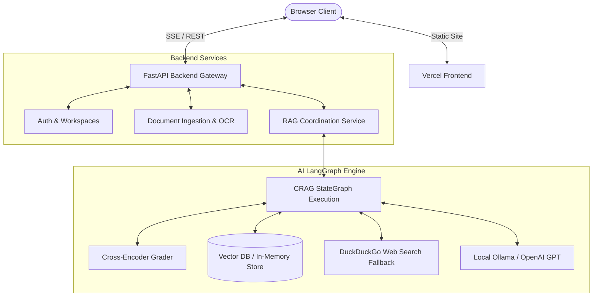
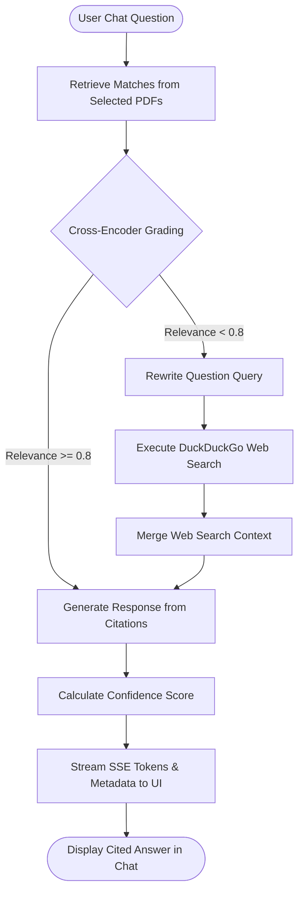

# 🛡️ DocuTrust: Enterprise Advanced RAG Platform

DocuTrust is a production-grade **Corrective Retrieval-Augmented Generation (CRAG)** platform designed for secure, self-correcting document question-answering with strict citations, multi-tenant workspace isolation, and real-time streaming feedback.

---

## 📊 System Architecture & Data Flow

### 1. High-Level Architecture Diagram


---

### 2. Corrective RAG (CRAG) Pipeline Flowchart


---

## 🌟 Key Features

*   **🛡️ Multi-User Workspaces:** Toggle between segregated virtual directories (e.g. `Finance`, `Legal`, `HR`) to isolate index libraries, document queries, and chat history.
*   **📑 Multi-PDF Context Filters:** Checkbox filters next to your indexed file library let you restrict Q&A context to specific documents.
*   **📷 Scanned PDF OCR Fallback:** Automatically detects non-text PDF pages and activates a simulated OCR extraction layer to recover data without crashing.
*   **🌊 Token-by-Token Streaming:** Streams assistant text word-by-word via Server-Sent Events (SSE) for a premium ChatGPT-like interface.
*   **🎯 Answer Confidence Gauge:** Dynamically calculates relevance metrics and prints a color-coded confidence score (Green/Orange/Red) next to the response.
*   **🔍 Interactive Source Preview:** Click citation tags `[Source: document, Page X]` to open a sliding inspector side-drawer displaying raw context chunks with matching keywords highlighted.
*   **💬 Chat History Sessions:** Collapsible left panel manages multiple chat sessions backed by local storage.
*   **👍 User Feedback Collection:** Thumbs up/down icons record helpfulness metrics via a backend analytics endpoint.
*   **📥 Chat Export to PDF:** Formatted CSS media rules render a clean, print-ready document log on PDF export.
*   **⚙️ Offline Ollama Option:** Switch between OpenAI and local Ollama instances (`llama3` / `nomic-embed-text`) in one `.env` setting.

---

## 🚀 Getting Started

### 1. Setup Environment
Rename or edit `backend/.env` with your active variables:
```env
OPENAI_API_KEY="your_openai_key_here"
USE_OLLAMA="false"

# MongoDB Vector Settings (Optional)
MONGODB_URI="your_mongodb_atlas_uri_here"
MONGODB_DB_NAME="docutrust_db"
MONGODB_COLLECTION="documents"
```

### 2. Launch Platform (Local)
Run the startup script in PowerShell:
```powershell
.\start.ps1
```
*   **Frontend Dashboard:** <http://127.0.0.1:8080>
*   **Backend FastAPI Server:** <http://127.0.0.1:8005>

---

## 🌐 Deployments
*   **GitHub Repository:** [manivitha26/doctrust](https://github.com/manivitha26/doctrust)
*   **Vercel Live Production URL:** [DocuTrust Frontend](https://frontend-rouge-eight-rvcpn8bwmz.vercel.app)
